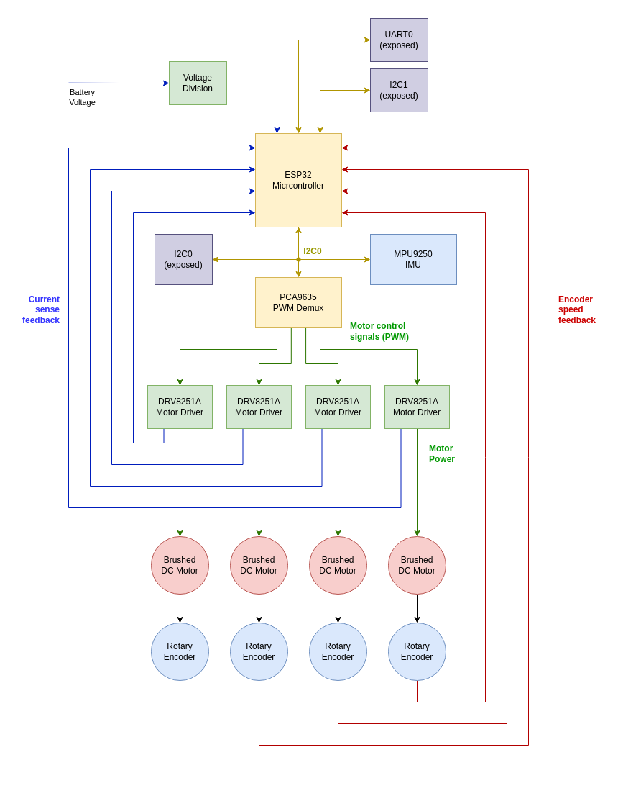
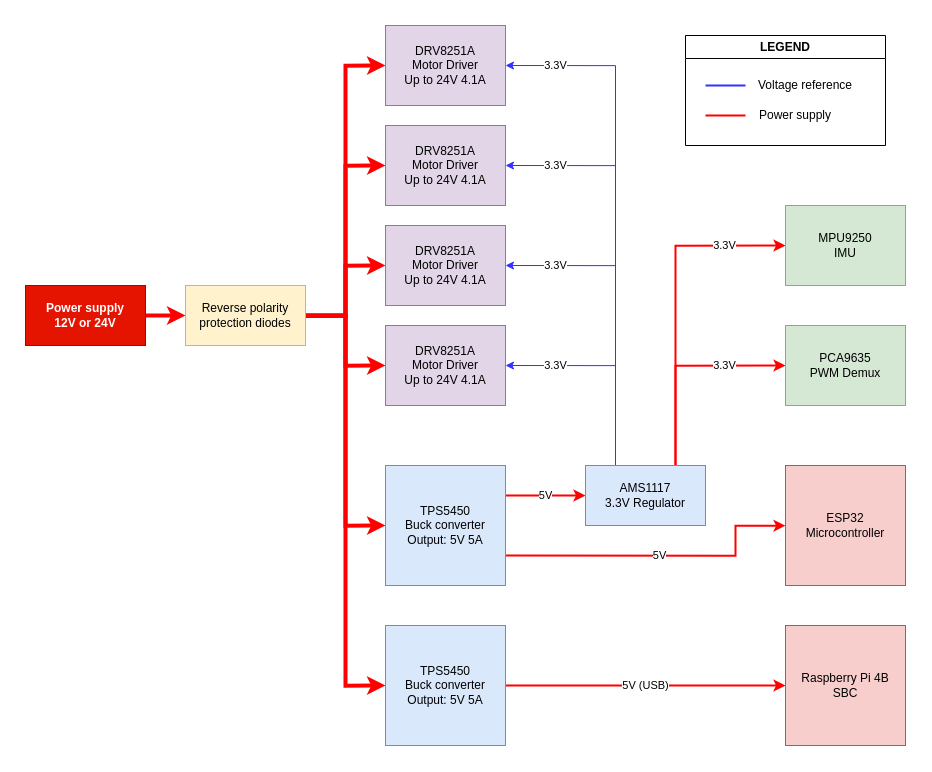

# Integrated Brain
The Integrated Brain is a custom PCB designed to control, supply power to, and monitor a four-wheeled robot. It's built on a master-slave architecture, with an ESP32 as the slave and an SBC (such as an NVIDIA Jetson or Raspberry Pi) as the master.

## Features
| Feature | Description | Specification |
| --- | --- | --- |
| ESP32 Microcontroller | Header for external ESP32 | **ESP32-WROOM-32** 38-pin dev board |
| Motor Drivers | Built on to the PCB | 4x **DRV8251A**. While the 8251A can provide up to **4.1 A**, the PCB design is compatible with other DRV series drivers too. |
| Motor Indicator LEDs | Built on to the PCB | 4x, user-controllable through the PWM demux. |
| Motor Encoder | Support for external quadrature encoders | Connect through JST-4 connectors, directly to ESP32 GPIO. |
| Motor Current Sense | Built on to the PCB | Using the 8251A's feature, connected to the ESP32 ADCs. Additional support for shunt resistor and current-sense amplifier in case of different motor driver IC. |
| IMU | Headers for external IMU | **MPU9250** connected over I2C0 to the ESP32 |
| Internal power supply | Built on to the PCB | **5V (5A)** (TPS5450 buck) and **3.3V** (AMS1117) power supplies for the ESP32 and other peripherals. |
| SBC Power supply | Built on to the PCB | **5V (5A)** (TPS5450 buck) power supply for the SBC., via USB-A. |
| PWM Demux | Built on to the PCB | **PCA9635** connected over I2C0 to the ESP32. Spare PWM channels are *not* exposed. |

## Overall system architecture

The ESP32 microcontroller handles the interaction between all the different peripherals, along with low-level control loops and signal processing. Telemetry and IMU data is fed directly to this ESP32.

Motors are driven using full H-bridge drivers, with built-in braking and current-sense capabilities. These motor drivers are controlled through a PWM demux, owing to the requirement for a large number of PWM pins.

Signals on-board are handled over I2C0, where the ESP32 acts as the master. It is configured as a slave on the I2C1 bus, which is used to communicate with an SBC. I2C0, I2C1, as well as an additional UART port are all exposed with JST connectors.

## Responsibilities of the ESP32 microcontroller
*   Receive commands from the SBC over I2C1
*   Control the motor drivers and the motor indicator LEDs, using the PCA9635 PWM mux over I2C0
*   Read the motor encoders and the motor current sense
*   Read the IMU data, over I2C0
*   Read the battery voltage (using a voltage divider)
*   Run the internal PID loop for motor control (RPM using encoder data)
*   Handle motor protection in case of stall (detected by encoder data) or disconnect (detected by current sense)
*   Filter IMU data
*   Send data to the SBC over I2C1 when requested

## Motor driver design
The system is designed to use the Texas Instruments DRV8251A motor driver, which is capable of driving up to 4.1 A.

Provided that DRV8251A (or any other DRV82\*\*A) drivers are used, we can leverage both the current-sense and current-limiting capabilities of the chip. Since the driver handles current attenuation, we may use a low-power high-resistance shunt resistor to generate a voltage drop. Additionally, using this as a voltage divider, we may supply a current limit; beyond this limit, the driver will automatically throttle voltage.

However, if an alternate motor driver is used (such as DRV8251), the system is designed to support a high-power low-resistance shunt resistor and a current-sense amplifier. The current-limiting feature of the driver will not be used in this case.

The equations to calculate these resistances were derived from the DRV8251A data sheet, and are provided in the schematics.

## Power supply design

The system is designed to take either 12 V or 24 V DC power. This can be given by either a DC barrel jack or an XT60 connector, designed with the intention of using a LiPo battery. This power must go through two diodes (hooked up in parallel) before being used for any purpose.

Conversion to 5 V and 3.3 V is handled on-board. The buck converter responsible for supplying power to the SBC is isolated from the rest of the system for increased stability.