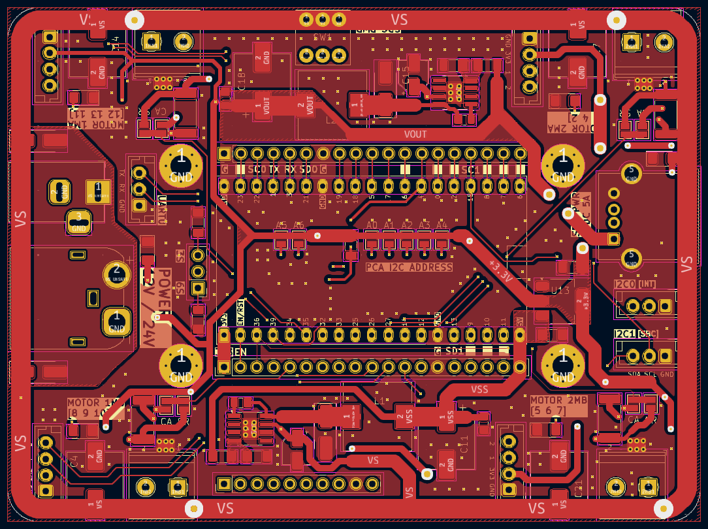
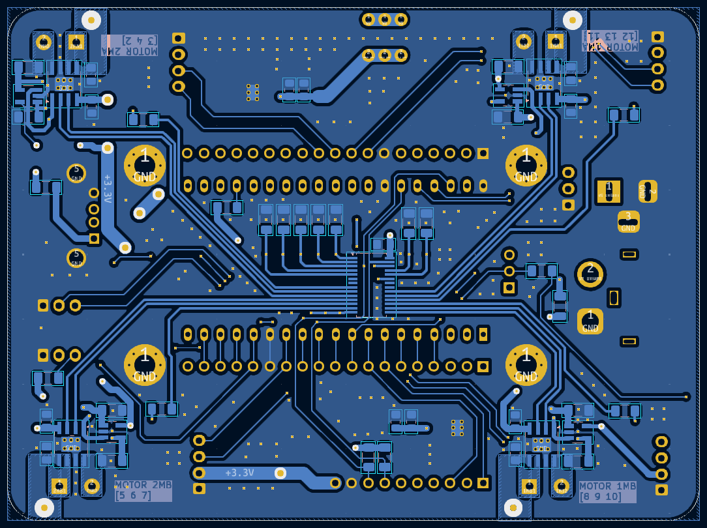
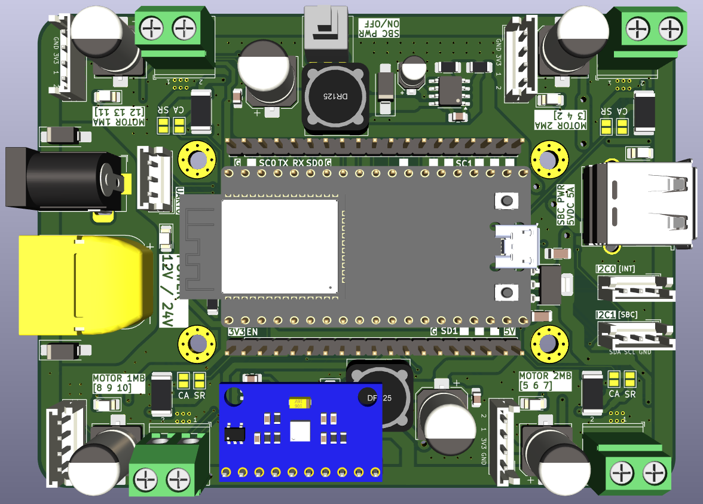
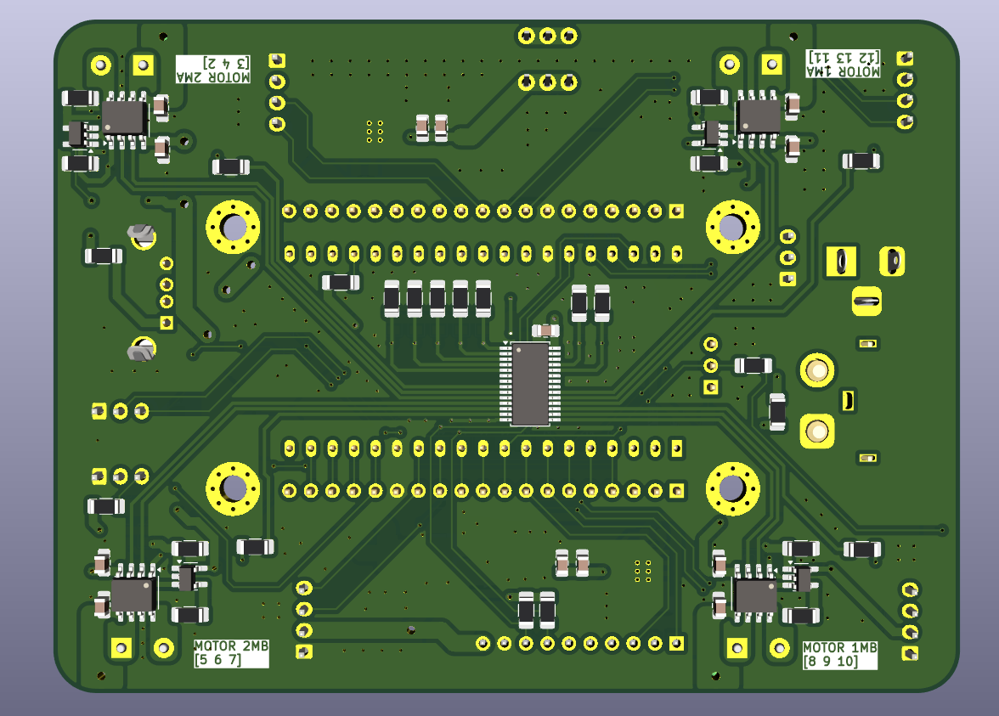
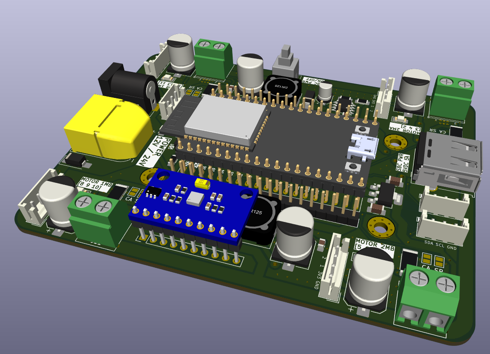

# Pin-outs

## IMU MPU9250
| MPU9250 | ESP32 GPIO |
| --- | --- |
| INT | 33 |
| FSYNC | 32 |

Use I2C0 for communication with the IMU.

## Motor Drivers
| Motor | DRV8251A | PCA9685 |
| --- | --- | --- |
| 1A | IN 1 | 12 |
| 1A | IN 2 | 13 |
| 1B | IN 1 | 8 |
| 1B | IN 2 | 9 |
| 2A | IN 1 | 3 |
| 2A | IN 2 | 4 |
| 2B | IN 1 | 5 |
| 2B | IN 2 | 6 |

Use I2C0 for communication with the PCA9685.

## Motor indicator LEDs
| Motor | PCA9685 |
| --- | --- |
| 1A | 11 |
| 1B | 10 |
| 2A | 2 |
| 2B | 7 |

Use I2C0 for communication with the PCA9685.

## Encoders
| Encoder | Pin | ESP32 GPIO |
| --- | --- | --- |
| 1A | 1 | 18 |
| 1A | 2 | 19 |
| 1B | 1 | 23 |
| 1B | 2 | 25 |
| 2A | 1 | 5 |
| 2A | 2 | 17 |
| 2B | 1 | 14 |
| 2B | 2 | 12 |

## Motor current sense
| Motor | ESP32 GPIO |
| --- | --- |
| 1A | 35 |
| 1B | 34 |
| 2A | 39 |
| 2B | 36 |

## Protocols
| Protocol | Pin | ESP32 GPIO | Built-in Pull-up |
| --- | --- | --- | --- |
| I2C0 | SDA | 21 | Yes, 4.7k to 3.3V |
| I2C0 | SCL | 22 | Yes, 4.7k to 3.3V |
| I2C1 | SDA | 13 | Yes, 4.7k to 3.3V |
| I2C1 | SCL | 15 | Yes, 4.7k to 3.3V |
| UART0 | TX | 1 | No |
| UART0 | RX | 3 | No |

Use I2C0 (as master) for communication with the IMU and PCA9685. Use I2C1 (as slave) for communication with an SBC such as a Raspberry Pi or NVIDIA Jetson.

## Miscellaneous
| Function | ESP32 GPIO |
| --- | --- |
| Battery Voltage | 25 |
| Motor PCA Enable | 4 |

# Screenshots

PCB Front

PCB Back

3D Front

3D Back

3D Angled
